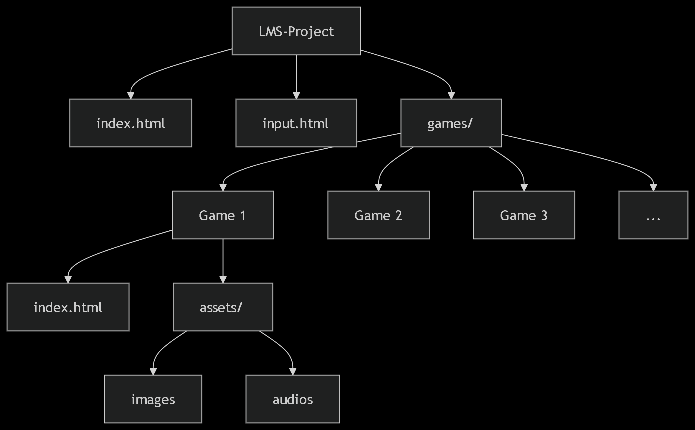
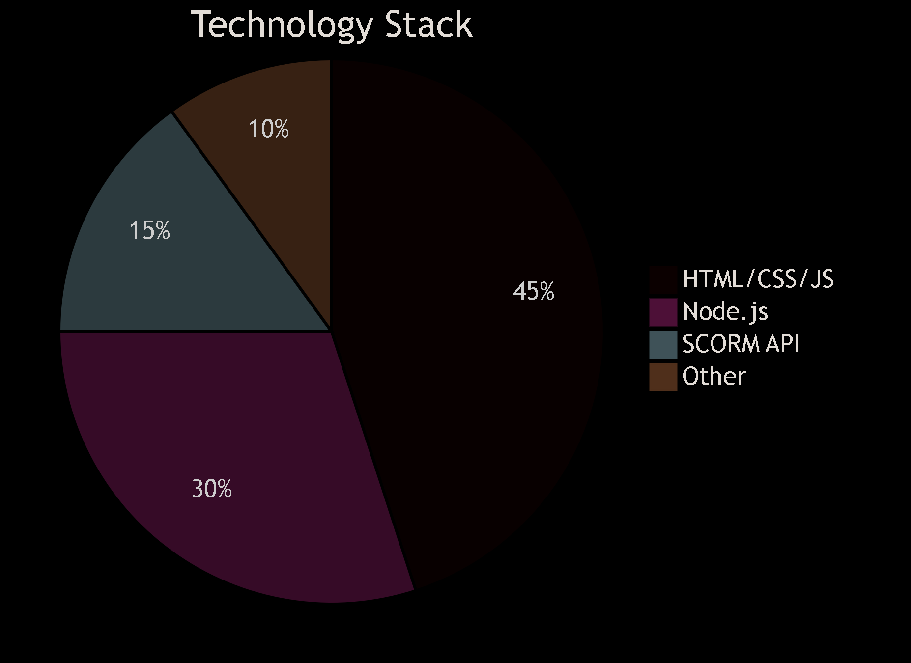

# 📚 LMS Project: Learning Management System

Welcome to the LMS Project 🌟 — a cutting-edge Learning Management System (LMS) crafted to provide an interactive, flexible, and user-friendly platform. This project empowers educators and learners with robust tools for managing educational content, tracking progress, integrating engaging games, and conducting assessments. 🎉

## 🔄 Clone the Repository
Clone the repository to your local machine with:

git clone https://github.com/Jawadahmad9938/LMS-Project.git

📦 Install Dependencies

## Install Dependencies
Navigate to the project directory and install the required Node.js dependencies:

cd LMS-Project

npm install
## ▶️ Launch the Application

Start the development server using:

npm start

Open your browser and visit http://localhost:3000 to experience the LMS in action! 🌐
## 📂 Project Structure
LMS-Project/

├── index.html
│   → Main entry point for the LMS application

├── input.html
│   → Input configuration or interface file

├── README.md
│   → Project documentation file

└── games/
    → Contains all game modules

    ├── game1/
    │   ├── index.html
    │   │   → Main file for Game 1
    │   ├── input.html
    │   │   → Input configuration for Game 1
    │   ├── input.js
    │   │   → JavaScript logic for Game 1
    │   └── assets/
    │       ├── audios/
    │       │   → Audio files for Game 1
    │       ├── images/
    │       │   → Image assets for Game 1
    │       └── content/
    │           → Additional content for Game 1
    │
    ├── game2/
    │   ├── index.html
    │   ├── input.html
    │   ├── input.js
    │   └── assets/
    │       ├── audios/
    │       ├── images/
    │       └── content/
    │
    ├── game3/
    │   ├── index.html
    │   ├── input.html
    │   ├── input.js
    │   └── assets/
    │       ├── audios/
    │       ├── images/
    │       └── content/
    │
    ├── game4/
    │   ├── index.html
    │   ├── input.html
    │   ├── input.js
    │   └── assets/
    │       ├── audios/
    │       ├── images/
    │       └── content/
    │
    ├── game5/
    │   ├── index.html
    │   ├── input.html
    │   ├── input.js
    │   └── assets/
    │       ├── audios/
    │       ├── images/
    │       └── content/
    │
    ├── game6/
    │   ├── index.html
    │   ├── input.html
    │   ├── input.js
    │   └── assets/
    │       ├── audios/
    │       ├── images/
    │       └── content/
    │
    └── game7/
        ├── index.html
        ├── input.html
        ├── input.js
        └── assets/
            ├── audios/
            ├── images/
            └── content/

## 🎯 Key Features
🧩 Modular Game Integration: Seamlessly add interactive games.

🎓 Dual Interfaces: Tailored for teachers and students.

📤 File Upload Support: Handle images, audio, and video uploads.

📊 Progress Tracking: Monitor and analyze learner progress.

🧠 SCORM Compliance: Supports SCORM API for industry standards.

📱 Responsive Design: Optimized for mobile, tablet, and desktop. 💻
## 🔧 Technologies Stack
Frontend: HTML, CSS, JavaScript 🌐

Runtime: Node.js ⚡

SCORM API: Integrated via scorm-api-wrapper 📚

Package Manager: npm 📦

 

## 📌 Important Notes
🚧 Development Status: Actively under development—stay tuned!

📦 Releases & Packages: No releases or packages published yet.

🤝 Contributions: Open to contributions—join us!

⚠️ Setup: Basic configuration files included for quick start.
## 📬 Contact Us
Author: Jawad Ahmad 👨‍💻

Repository: github.com/Jawadahmad9938/LMS-Project 📦

Support: Reach out via GitHub Issues for assistance! 💬
## 🤝 Contributing
We warmly welcome contributions, issues, and feature requests! 🌍 Follow these steps to contribute:

Fork the repository 🍴

Create a new branch: git checkout -b feature/my-feature 🌿

Commit your changes: git commit -m 'Add my feature' ✅

Push to the branch: git push origin feature/my-feature 🚀

Open a Pull Request 🌉
## License

[MIT](https://choosealicense.com/licenses/mit/)

## Support

For support, email jawadahmad9938@gmail.com or join our Slack channel.

